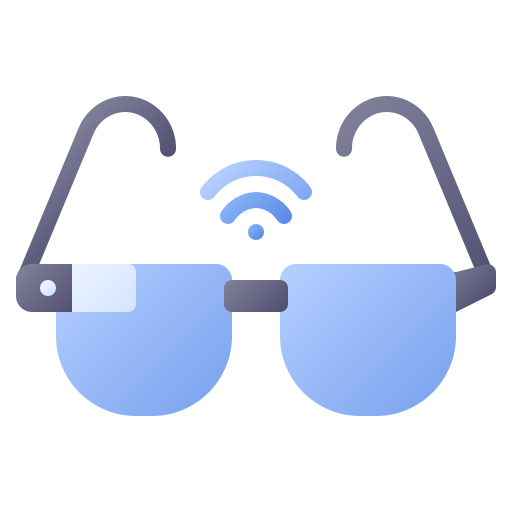

<div id="top"></div>
<!--
*** Thanks for checking out the Best-README-Template. If you have a suggestion
*** that would make this better, please fork the repo and create a pull request
*** or simply open an issue with the tag "enhancement".
*** Don't forget to give the project a star!
*** Thanks again! Now go create something AMAZING! :D
-->

<!-- PROJECT SHIELDS -->
<!--
*** I'm using markdown "reference style" links for readability.
*** Reference links are enclosed in brackets [ ] instead of parentheses ( ).
*** See the bottom of this document for the declaration of the reference variables
*** for contributors-url, forks-url, etc. This is an optional, concise syntax you may use.
*** https://www.markdownguide.org/basic-syntax/#reference-style-links
-->

[![Contributors][contributors-shield]][contributors-url]
[![Forks][forks-shield]][forks-url]
[![Stargazers][stars-shield]][stars-url]
[![Issues][issues-shield]][issues-url]
[![MIT License][license-shield]][license-url]
[![LinkedIn][linkedin-shield]][linkedin-url]

<!-- PROJECT LOGO -->
<br />
<div align="center">
  <a href="https://github.com/taoufikayoub/BlindSupportApp">
    
  </a>

<h3 align="center">Blind Support Project</h3>

  <p align="center">
    A project that helps blind people in their daily life using ESP32-CAM, Mobile 
    <br />
    <a href="https://github.com/taoufikayoub/BlindSupportApp"><strong>Explore the docs »</strong></a>
    <br />
    <br />
    <a href="https://github.com/taoufikayoub/BlindSupportApp">View Demo</a>
    ·
    <a href="https://github.com/taoufikayoub/BlindSupportApp/issues">Report Bug</a>
    ·
    <a href="https://github.com/taoufikayoub/BlindSupportApp/issues">Request Feature</a>
  </p>
</div>

<!-- TABLE OF CONTENTS -->
<details>
  <summary>Table of Contents</summary>
  <ol>
    <li>
      <a href="#about-the-project">About The Project</a>
      <ul>
        <li><a href="#built-with">Built With</a></li>
      </ul>
    </li>
    <li>
      <a href="#getting-started">Getting Started</a>
      <ul>
        <li><a href="#prerequisites">Prerequisites</a></li>
        <li><a href="#installation">Installation</a></li>
      </ul>
    </li>
    <li><a href="#usage">Usage</a></li>
    <li><a href="#roadmap">Roadmap</a></li>
    <li><a href="#contributing">Contributing</a></li>
    <li><a href="#license">License</a></li>
    <li><a href="#contact">Contact</a></li>
    <li><a href="#acknowledgments">Acknowledgments</a></li>
  </ol>
</details>

<!-- ABOUT THE PROJECT -->

## About The Project

[![Product Name Screen Shot][product-screenshot]](https://example.com)

Here's a blank template to get started: To avoid retyping too much info. Do a search and replace with your text editor for the following: `taoufikayoub`, `BlindSupportApp`, `ayoub107p5`, `taoufik-ayoub`, `ensam-casa.ma`, `taoufik.ayoub`, `Blind Support Project`, `A project that helps blind people in their daily life using machine learning, mobile app and ESP32-CAM glasses`

<p align="right">(<a href="#top">back to top</a>)</p>

### Built With

- [React Native](https://reactnative.dev/)
- [EXPO](https://expo.dev/)
- [FLASK](https://flask.palletsprojects.com/en/2.1.x/)

<p align="right">(<a href="#top">back to top</a>)</p>

<!-- GETTING STARTED -->

## Getting Started

This is how you can recreate this project on your local machine.

### Prerequisites

This is an example of how to list things you need to use the software and how to install them.

- Expo CLI

  ```sh
  npm install expo-cli@latest -g
  ```

- ESP32-CAM with WEBSERVER Installed connected to your local WIFI

### Installation

1. Clone the repo

   ```sh
   git clone https://github.com/taoufikayoub/BlindSupportApp.git
   ```

2. Enter the project directory
   ```sh
   git clone https://github.com/taoufikayoub/BlindSupportApp.git
   ```

- Mobile App Installation

3. Enter mobile project folder

   ```sh
   cd mobile
   ```

4. Install NPM packages

   ```sh
   expo install
   ```

5. Enter your routes in `config.ts`

   ```js
   export const ESP32_CAM_URI = "ENTER YOUR ESP32-CAM IP ADDRESS"; // You will get it from the ESP32-CAM Serial on loading
   export const SERVER_URI = "ENTER THE FLASK SERVER ADDRESS HERE"; // You will get it from the FLASK server debug messages on Loading too
   ```

6. Run the app (check if you are unfamiliar with expo)

```sh
 expo install
```

- Server Installation

7. cd server

8. pip install virtualenv (if you don't already have virtualenv installed)

9. virtualenv venv

10. ./venv/Scripts/activate

11. pip install -r requirements.txt

12. flask run

<p align="right">(<a href="#top">back to top</a>)</p>

<!-- USAGE EXAMPLES -->

## Usage

- First Tab: Recognizing Faces

- Second Tab: Add known faces to the server

<p align="right">(<a href="#top">back to top</a>)</p>

<!-- CONTRIBUTING -->

## Contributing

Contributions are what make the open source community such an amazing place to learn, inspire, and create. Any contributions you make are **greatly appreciated**.

If you have a suggestion that would make this better, please fork the repo and create a pull request. You can also simply open an issue with the tag "enhancement".
Don't forget to give the project a star! Thanks again!

1. Fork the Project
2. Create your Feature Branch (`git checkout -b feature/AmazingFeature`)
3. Commit your Changes (`git commit -m 'Add some AmazingFeature'`)
4. Push to the Branch (`git push origin feature/AmazingFeature`)
5. Open a Pull Request

<p align="right">(<a href="#top">back to top</a>)</p>

<!-- LICENSE -->

## License

Distributed under the MIT License.

<p align="right">(<a href="#top">back to top</a>)</p>

<!-- CONTACT -->

## Contact

Ayoub Taoufik - [@ayoub107p5](https://twitter.com/ayoub107p5) - taoufik.ayoub@ensam-casa.ma

Project Link: [https://github.com/taoufikayoub/BlindSupportApp](https://github.com/taoufikayoub/BlindSupportApp)

<p align="right">(<a href="#top">back to top</a>)</p>

<!-- ACKNOWLEDGMENTS -->

## Acknowledgments

- []()
- []()
- []()

<p align="right">(<a href="#top">back to top</a>)</p>

<!-- MARKDOWN LINKS & IMAGES -->
<!-- https://www.markdownguide.org/basic-syntax/#reference-style-links -->

[contributors-shield]: https://img.shields.io/github/contributors/taoufikayoub/BlindSupportApp.svg?style=for-the-badge
[contributors-url]: https://github.com/taoufikayoub/BlindSupportApp/graphs/contributors
[forks-shield]: https://img.shields.io/github/forks/taoufikayoub/BlindSupportApp.svg?style=for-the-badge
[forks-url]: https://github.com/taoufikayoub/BlindSupportApp/network/members
[stars-shield]: https://img.shields.io/github/stars/taoufikayoub/BlindSupportApp.svg?style=for-the-badge
[stars-url]: https://github.com/taoufikayoub/BlindSupportApp/stargazers
[issues-shield]: https://img.shields.io/github/issues/taoufikayoub/BlindSupportApp.svg?style=for-the-badge
[issues-url]: https://github.com/taoufikayoub/BlindSupportApp/issues
[license-shield]: https://img.shields.io/github/license/taoufikayoub/BlindSupportApp.svg?style=for-the-badge
[license-url]: https://github.com/taoufikayoub/BlindSupportApp/blob/master/LICENSE.txt
[linkedin-shield]: https://img.shields.io/badge/-LinkedIn-black.svg?style=for-the-badge&logo=linkedin&colorB=555
[linkedin-url]: https://linkedin.com/in/taoufik-ayoub
[product-screenshot]: images/screenshot.png
